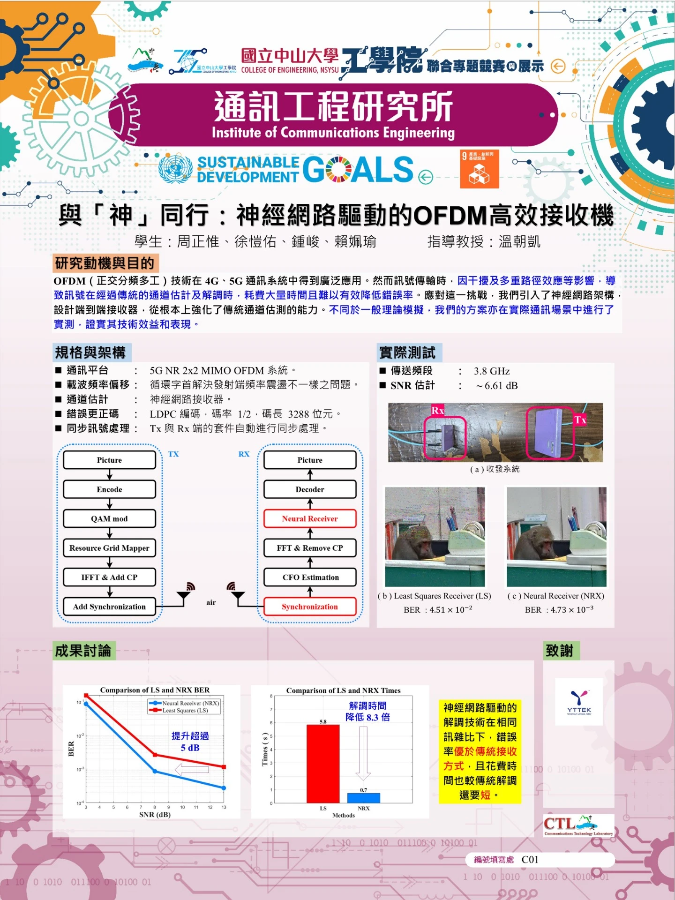

# Neural Network-Driven OFDM Receiver

> A neural network-driven receiver for a **5G NR 2×2 MIMO-OFDM** system, implemented with **Python and NVIDIA Sionna** and experimentally validated through an **SDR-based over-the-air (OTA) testbed**.

🏆 **Outstanding Award — NSYSU College of Engineering Joint Project Competition & Exhibition**

---

## Overview

Orthogonal Frequency Division Multiplexing (**OFDM**) is widely used in 4G and 5G communication systems. However, in practical wireless environments, interference and multipath effects can degrade received signals, while conventional channel estimation and equalization may require significant processing time.

This project develops a **Neural Network-Driven OFDM Receiver (NRX)** to enhance the receiver's capability beyond conventional channel-estimation-based approaches.

The proposed system was implemented using **Python and NVIDIA Sionna** and experimentally validated through an **SDR-based OTA communication platform**.

---

## System Architecture

### System Specifications

| Item                 | Specification         |
| -------------------- | --------------------- |
| Communication System | 5G NR 2×2 MIMO-OFDM   |
| MIMO Configuration   | 2 Tx × 2 Rx           |
| Carrier Frequency    | 3.8 GHz               |
| Modulation           | QAM                   |
| Channel Coding       | LDPC                  |
| Code Rate            | 1/2                   |
| Codeword Length      | 3288 bits             |
| Receiver             | Neural Receiver (NRX) |
| Framework            | NVIDIA Sionna         |
| Programming Language | Python                |
| Test Platform        | SDR / OTA             |

### Transmitter

`Picture → Encode → QAM Modulation → Resource Grid Mapping → IFFT & Add CP → Synchronization → SDR Tx`

### Receiver

`SDR Rx → Synchronization → CFO Estimation → FFT & Remove CP → Neural Receiver → Decoder → Picture`

The **Neural Receiver** replaces the conventional channel-estimation-based receiver processing and directly learns to recover information from the received OFDM signal.

---

## Neural Receiver

A conventional OFDM receiver relies on channel estimation followed by signal detection to recover the transmitted information.

In this project, a **Neural Receiver (NRX)** is introduced as a learning-based alternative:

**Conventional Receiver**

`Received OFDM Signal → Channel Estimation → Detector → Decoding`

**Proposed Receiver**

`Received OFDM Signal → Neural Receiver → Decoding`

The neural receiver learns the relationship between the received OFDM resource grid and the transmitted information, reducing reliance on conventional channel estimation and detection algorithms.

---

## SDR-Based OTA Experiment

The proposed receiver was evaluated using an **SDR-based 2×2 MIMO wireless testbed** operating at **3.8 GHz**.

Instead of relying solely on simulation, the system was tested through actual OTA transmission to evaluate the receiver under practical wireless-channel conditions.

The measured experimental SNR was approximately:

**SNR ≈ 6.61 dB**

Image data was transmitted through the wireless channel and reconstructed at the receiver to compare the performance of:

* **Least Squares Receiver (LS)**
* **Neural Receiver (NRX)**

---

## Results

### BER Performance

The Neural Receiver achieved a lower **Bit Error Rate (BER)** than the conventional Least Squares receiver under the evaluated OTA conditions.

The experimental results demonstrated a receiver performance improvement of more than:

> **5 dB**

compared with the conventional LS-based receiver.

### Example OTA Result

| Receiver              |         BER |
| --------------------- | ----------: |
| Least Squares (LS)    | 4.51 × 10⁻² |
| Neural Receiver (NRX) | 4.73 × 10⁻³ |

The reconstructed image obtained using the Neural Receiver exhibited significantly fewer transmission errors than the LS-based receiver under the evaluated wireless condition.

---

## Processing Time

The processing time of the Neural Receiver was also compared with the conventional LS-based receiver.

| Receiver              | Processing Time |
| --------------------- | --------------: |
| Least Squares (LS)    |           5.8 s |
| Neural Receiver (NRX) |           0.7 s |

The Neural Receiver reduced the measured processing time by approximately:

> **8.3×**

under the evaluated setup.

---

## Key Results

* **5G NR 2×2 MIMO-OFDM** OTA communication platform
* Neural-network-based receiver implemented with **Python and NVIDIA Sionna**
* Real-world **SDR-based OTA transmission**
* **>5 dB** receiver performance improvement compared with LS
* BER reduced from **4.51 × 10⁻² to 4.73 × 10⁻³** in the demonstrated experiment
* Processing time reduced from **5.8 s to 0.7 s**
* Approximately **8.3× faster** processing under the evaluated setup
* 🏆 **Outstanding Award** at the NSYSU College of Engineering Joint Project Competition & Exhibition

---

## Technologies

`Python` `NVIDIA Sionna` `TensorFlow` `5G NR` `MIMO` `OFDM` `Neural Networks` `LDPC` `QAM` `SDR` `OTA`

---

## Source Code Availability

This repository contains selected source code, system configurations, experimental results, and documentation from the project.

Some components, including parts of the receiver implementation, trained model parameters, SDR interfaces, and laboratory-specific code, are not publicly released due to project and intellectual-property considerations.

The provided `main.ipynb` demonstrates the main **MIMO-OFDM system configuration, NVIDIA Sionna-based PHY setup, receiver workflow, and experimental GUI**.

---

## Project Poster

  

---

## Award

🏆 **Outstanding Award**
**College of Engineering Joint Project Competition & Exhibition**
National Sun Yat-sen University

[Official Award List](https://113gongxueyuanlianhezhuantijingsaiyuzhanshi.webnode.page/%e5%be%97%e7%8d%8e%e5%90%8d%e5%96%ae2/)

---

## Acknowledgements

Special thanks to **YTTEK Technology Corp.** for providing the SDR platform used in the OTA experiments.
